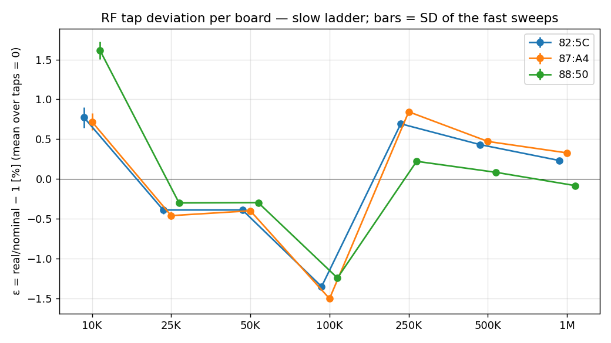
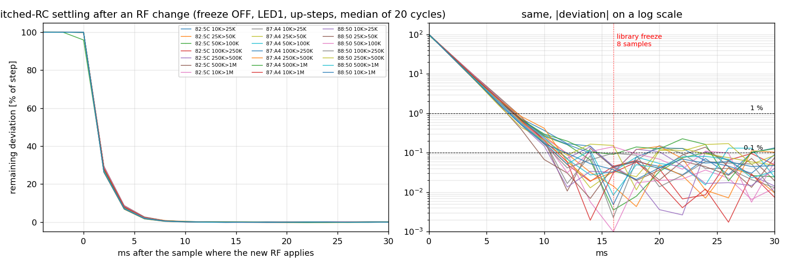

# RF tap characterisation under constant light — 2026-10-08

_Generated by `tools/rf_tap_analyze.py` from `docs/rf_taps/raw/2026-10-08_*.csv`; conclusions below the tables are written by hand._

## Board 10:51:DB:50:82:5C (fw 0.22, lib 0.104) — 220765 rows, 442 s, 0 lost

Offset `V_off` per phase [mV]: LED1 +1.21, ALED1 +0.74, LED2 +1.22, ALED2 +0.74. Reference (100K) light drift +9.69 %/min. Fit residual 0.158 % RMS. Saturated taps: none.

I_amb 788 nA. The split between `V_off` and the ε pattern is not identifiable from one light level (a ridge picks the smallest pattern); the last column gives how much each ε moves per +1 mV of offset.

**Two light levels** (this run, I_amb 789 nA, joined with the 10:08 run at 1464 nA): the degeneracy is broken; `V_off` = LED1 +1.61 mV, ALED1 +1.11 mV, LED2 +1.60 mV, ALED2 +1.11 mV; residual 0.341 % (now) / 0.371 % (extra). The ε in the table's second column are these.

| tap | ε one level, ridge (B) [%] | ε two levels [%] | ε fast (C) mean ± SD [%] | SD per sample [%] | SD of 50 ms means [%] | ε shift per +1 mV offset [%] |
|---|---|---|---|---|---|---|
| 10K | +0.77 | -2.89 | -4.16 ± 0.13 | 0.467 | 0.408 | -9.48 |
| 25K | -0.39 | -1.03 | -0.95 ± 0.05 | 0.367 | 0.329 | -1.87 |
| 50K | -0.39 | -0.15 | -0.21 ± 0.04 | 0.377 | 0.336 | +0.67 |
| 100K | -1.35 | -0.59 | -0.45 ± 0.02 | 0.456 | 0.432 | +1.94 |
| 250K | +0.69 | +1.90 | +2.14 ± 0.02 | 0.432 | 0.415 | +2.70 |
| 500K | +0.43 | +1.30 | +1.92 ± 0.02 | 0.405 | 0.386 | +2.96 |
| 1M | +0.23 | +1.46 | +1.71 ± 0.02 | 0.361 | 0.342 | +3.08 |

| pair | OT step, toggles D (freeze on) [%] | same from ladder ε (two-level) [%] | freeze OFF: samples to 1 % / 0.1 % of step (up ; down) | deviation at sample 0 / 1 / 2 / 4 after the step [% of step] |
|---|---|---|---|---|
| 10K ↔ 25K | +2.97 ± 0.12 (n=40) | +1.92 | 4 / 8 ; 4 / 11 | +100.0 / +29.3 / +8.5 / +0.73 |
| 25K ↔ 50K | +0.79 ± 0.04 (n=40) | +0.89 | 4 / 6 ; 4 / 6 | +100.0 / +29.2 / +8.5 / +0.74 |
| 50K ↔ 100K | -0.22 ± 0.04 (n=40) | -0.44 | 4 / 7 ; 4 / 7 | +99.9 / +28.9 / +8.3 / +0.70 |
| 100K ↔ 250K | +2.64 ± 0.02 (n=40) | +2.50 | 4 / 6 ; 4 / 6 | +100.0 / +29.1 / +8.5 / +0.64 |
| 250K ↔ 500K | -0.19 ± 0.01 (n=40) | -0.59 | 4 / 8 ; 4 / 6 | +100.0 / +29.1 / +8.3 / +0.70 |
| 500K ↔ 1M | -0.17 ± 0.01 (n=38) | +0.16 | 4 / 8 ; 4 / 7 | +100.0 / +29.4 / +8.7 / +0.82 |
| 10K ↔ 1M | — | — | 4 / 6 ; 4 / 6 | +100.0 / +29.1 / +8.5 / +0.72 |

## Board 10:51:DB:50:87:A4 (fw 0.22, lib 0.104) — 220765 rows, 442 s, 0 lost

Offset `V_off` per phase [mV]: LED1 -4.77, ALED1 -4.75, LED2 -4.77, ALED2 -4.76. Reference (100K) light drift +10.96 %/min. Fit residual 0.201 % RMS. Saturated taps: none.

I_amb 718 nA. The split between `V_off` and the ε pattern is not identifiable from one light level (a ridge picks the smallest pattern); the last column gives how much each ε moves per +1 mV of offset.

**Two light levels** (this run, I_amb 723 nA, joined with the 10:08 run at 1332 nA): the degeneracy is broken; `V_off` = LED1 -4.53 mV, ALED1 -4.52 mV, LED2 -4.53 mV, ALED2 -4.52 mV; residual 0.551 % (now) / 0.612 % (extra). The ε in the table's second column are these.

| tap | ε one level, ridge (B) [%] | ε two levels [%] | ε fast (C) mean ± SD [%] | SD per sample [%] | SD of 50 ms means [%] | ε shift per +1 mV offset [%] |
|---|---|---|---|---|---|---|
| 10K | +0.72 | -1.95 | -3.40 ± 0.11 | 1.490 | 1.143 | -10.41 |
| 25K | -0.46 | -0.92 | -0.88 ± 0.05 | 0.643 | 0.559 | -2.05 |
| 50K | -0.40 | -0.19 | -0.25 ± 0.03 | 0.481 | 0.393 | +0.74 |
| 100K | -1.50 | -1.01 | -0.76 ± 0.02 | 0.527 | 0.481 | +2.13 |
| 250K | +0.84 | +1.82 | +2.06 ± 0.02 | 0.476 | 0.438 | +2.96 |
| 500K | +0.47 | +1.10 | +1.69 ± 0.02 | 0.440 | 0.403 | +3.24 |
| 1M | +0.33 | +1.15 | +1.53 ± 0.02 | 0.393 | 0.356 | +3.38 |

| pair | OT step, toggles D (freeze on) [%] | same from ladder ε (two-level) [%] | freeze OFF: samples to 1 % / 0.1 % of step (up ; down) | deviation at sample 0 / 1 / 2 / 4 after the step [% of step] |
|---|---|---|---|---|
| 10K ↔ 25K | +2.35 ± 0.08 (n=40) | +1.05 | 4 / 6 ; 4 / 6 | +99.9 / +28.2 / +8.0 / +0.72 |
| 25K ↔ 50K | +0.66 ± 0.05 (n=40) | +0.74 | 4 / 6 ; 4 / 6 | +99.9 / +27.9 / +7.8 / +0.62 |
| 50K ↔ 100K | -0.46 ± 0.02 (n=40) | -0.81 | 4 / 6 ; 4 / 6 | +100.0 / +28.3 / +8.1 / +0.68 |
| 100K ↔ 250K | +2.87 ± 0.01 (n=40) | +2.86 | 4 / 7 ; 4 / 6 | +99.9 / +28.0 / +7.7 / +0.68 |
| 250K ↔ 500K | -0.33 ± 0.01 (n=40) | -0.71 | 4 / 6 ; 4 / 7 | +99.9 / +28.2 / +8.0 / +0.84 |
| 500K ↔ 1M | -0.12 ± 0.01 (n=38) | +0.04 | 4 / nan ; 4 / 6 | +95.9 / +27.7 / +7.5 / +0.70 |
| 10K ↔ 1M | — | — | 4 / 6 ; 4 / 6 | +100.0 / +28.2 / +8.0 / +0.67 |

## Board 10:51:DB:50:88:50 (fw 0.22, lib 0.104) — 220775 rows, 442 s, 0 lost

Offset `V_off` per phase [mV]: LED1 -6.55, ALED1 -6.43, LED2 -6.55, ALED2 -6.44. Reference (100K) light drift +11.41 %/min. Fit residual 0.225 % RMS. Saturated taps: none.

I_amb 698 nA. The split between `V_off` and the ε pattern is not identifiable from one light level (a ridge picks the smallest pattern); the last column gives how much each ε moves per +1 mV of offset.

**Two light levels** (this run, I_amb 704 nA, joined with the 10:08 run at 1299 nA): the degeneracy is broken; `V_off` = LED1 -6.43 mV, ALED1 -6.31 mV, LED2 -6.43 mV, ALED2 -6.31 mV; residual 0.603 % (now) / 0.947 % (extra). The ε in the table's second column are these.

| tap | ε one level, ridge (B) [%] | ε two levels [%] | ε fast (C) mean ± SD [%] | SD per sample [%] | SD of 50 ms means [%] | ε shift per +1 mV offset [%] |
|---|---|---|---|---|---|---|
| 10K | +1.62 | +0.06 | -1.85 ± 0.11 | 9.152 | 5.723 | -10.71 |
| 25K | -0.30 | -0.61 | -0.58 ± 0.03 | 0.699 | 0.591 | -2.11 |
| 50K | -0.30 | -0.12 | -0.15 ± 0.02 | 0.515 | 0.421 | +0.76 |
| 100K | -1.24 | -1.04 | -0.63 ± 0.02 | 0.545 | 0.498 | +2.19 |
| 250K | +0.22 | +0.96 | +1.22 ± 0.02 | 0.476 | 0.446 | +3.05 |
| 500K | +0.08 | +0.48 | +1.10 ± 0.03 | 0.443 | 0.406 | +3.34 |
| 1M | -0.08 | +0.28 | +0.90 ± 0.03 | 0.392 | 0.359 | +3.48 |

| pair | OT step, toggles D (freeze on) [%] | same from ladder ε (two-level) [%] | freeze OFF: samples to 1 % / 0.1 % of step (up ; down) | deviation at sample 0 / 1 / 2 / 4 after the step [% of step] |
|---|---|---|---|---|
| 10K ↔ 25K | +1.02 ± 0.14 (n=40) | -0.67 | 4 / 6 ; 4 / 6 | +100.0 / +26.4 / +6.9 / +0.51 |
| 25K ↔ 50K | +0.52 ± 0.04 (n=40) | +0.49 | 4 / 5 ; 4 / 6 | +99.8 / +26.2 / +6.8 / +0.40 |
| 50K ↔ 100K | -0.42 ± 0.01 (n=40) | -0.92 | 4 / 9 ; 4 / 6 | +100.0 / +26.6 / +7.3 / +0.58 |
| 100K ↔ 250K | +1.91 ± 0.01 (n=40) | +2.03 | 4 / 6 ; 4 / 6 | +99.9 / +26.4 / +7.0 / +0.58 |
| 250K ↔ 500K | -0.10 ± 0.01 (n=40) | -0.48 | 4 / 14 ; 4 / 6 | +99.9 / +26.4 / +6.8 / +0.44 |
| 500K ↔ 1M | -0.15 ± 0.01 (n=38) | -0.19 | 4 / 8 ; 4 / 6 | +100.0 / +26.8 / +7.2 / +0.54 |
| 10K ↔ 1M | — | — | 4 / 6 ; 4 / 6 | +100.0 / +26.5 / +7.0 / +0.52 |

<!-- tables-end -->

## Conclusions

### Summary

Three V18 boards, probes with the LEDs covered (ambient light only, the same current in the four
phases), fw 0.22 / lib 0.104, every TIA gain tap walked under HGAC-off. Raw data at 500 Hz in
`raw/2026-10-08_<MAC>.csv` (phases A–G, ~220 k rows per board, 0 lost). A second light level, the
10:08 run (`captures/rf_taps/`, same boards, light ×1.9), is joined to the fit.

1. **Switched-RC settling after an RF change is a clean single exponential, the same for every
   tap, every step size, both directions and the three chips**: 29 % of the step left after one
   sample, 8.5 % after two, 2.4 % after three, 0.7 % after four, 0.2 % after five, 0.07 % after
   six (k ≈ 0.29 per PRP, τ ≈ 0.8 samples = 1.6 ms at 500 Hz). No slower tail down to the noise
   floor (±0.1 % of step at 15–30 samples). The datasheet's "≥ 3 ms cumulative sampling per phase"
   (§7.7 t5) is this filter; the library's 8-sample freeze leaves 0.005 % — measured at the first
   free sample: ≤ 0.12 % of the step, noise-limited.
2. **A fast calibration sweep is viable as far as settling and noise go.** Discarding 6 samples
   after each change (0.1 %) and averaging the next 40 gives a level with 0.06 % precision per
   tap: 7 taps in ~650 ms, repeatable to 0.02–0.1 % across 11 sweeps. What limits a sweep is not
   time: it is the offset (point 3) and the light/signal stability, not the chip.
3. **The analog chain has an additive offset, per chip, the same in the four phases**: +1.6 mV
   (82:5C), −4.5 mV (87:A4), −6.4 mV (88:50); the ALED phases differ from the LED phases by
   +0.5 mV on 82:5C and ≤ 0.1 mV on the others. It is not in the datasheet. At 10K it is of the
   order of the signal itself (V_TIA at 10K this afternoon: 9.7 / 3.0 / 1.1 mV), so **levels at
   different taps cannot be compared by plain ratios**, and — the lesson of the morning analysis —
   **one light level cannot separate the offset from the tap pattern**: ε'_tap = ε_tap − δ/(I·RF) + c
   fits any δ. Two light levels (or a dark reading) are needed; the 10:08 run supplied the second.
4. **Tap pattern ε (real/nominal − 1, mean 0), two-level fit**, in %:

   | board | 10K | 25K | 50K | 100K | 250K | 500K | 1M |
   |---|---|---|---|---|---|---|---|
   | 82:5C | −2.9 | −1.0 | −0.2 | −0.6 | +1.9 | +1.3 | +1.5 |
   | 87:A4 | −2.0 | −0.9 | −0.2 | −1.0 | +1.8 | +1.1 | +1.2 |
   | 88:50 | +0.1 | −0.6 | −0.1 | −1.0 | +1.0 | +0.5 | +0.3 |

   Everything is far inside the ±7 % of the datasheet. 25K–1M agree across chips within ~0.5 %
   (a design pattern more than chip scatter); 10K is unreliable (it moves 10 % per mV of offset
   error, and on 88:50 the signal there is 1 mV).
5. **One-tap OT steps** — what an HGAC move adds to OT — measured directly by toggling
   (40 cycles, light drift cancelled), in %: 25K→50K +0.8 / +0.7 / +0.5; 50K→100K −0.2 / −0.5 /
   −0.4; 100K→250K +2.6 / +2.9 / +1.9; 250K→500K −0.2 / −0.3 / −0.1; 500K→1M −0.2 / −0.1 / −0.2;
   10K→25K +3.0 / +2.4 / +1.0 (offset-limited). Freeze on and off give the same steps (≤ 0.14 %),
   RF1 and RF2 give the same steps (≤ 0.05 %): **the two colours share the physical resistor**.
6. **The simulator run of the night (OT with the LEDs on, 82:5C) is confirmed, not contradicted**:
   it measured 25K↔50K ≈ +0.8/+0.9 % and 10K↔50K ≈ +4.5 % on OT; this bench gives +0.8 % and
   ≈ +3.8 % (offset-limited at 10K). The morning's single-level analysis, which disagreed, was the
   wrong one.

### What this means for the pending task (measure the real RF of each tap)

- **Possible, and the chip settles fast enough for a sweep of a few hundred ms.** The obstacle is
  not settling but the additive offset, which contaminates every V_TIA-based comparison at low
  gain and cannot be identified from one illumination.
- **In the product the right observable is OT, not V_TIA.** OT = (LED − ALED)/I_LED: the offset is
  the same in the LED and ALED phases (to 0.1–0.5 mV), so it cancels, and OT_hi/OT_lo =
  (1+ε_hi)/(1+ε_lo) exactly. That is what the simulator measured. An in-product calibration is
  therefore: LEDs on, signal stable (or many short toggles so the pulse averages out), toggle each
  neighbouring pair for a few hundred ms, take the OT ratio. No dark reading, no second light
  level, no offset model.
- **Worth it?** The pattern is similar on the three chips at 25K–1M (±0.5 %), and the only moves
  above 1 % are 100K↔250K (+2…+3 %) and anything involving 10K. A library constant table would
  already remove most of the step; a per-board OT-ratio calibration would remove the rest. Against
  this stands the alternative that needs no calibration at all: excluding ~1 s of window blocks
  after an RF change. The decision is Alex's; the numbers to weigh are the one-tap steps above
  against the SpO2 effect measured on the simulator (≈ 2 points for 6 s per 1 % of OT step at
  PI 1 %).
- **For the HGAC/RSQM thresholds on V_TIA and I_PD**: the offset (−6 mV on 88:50) is 3 % of the
  0.2 V `hgac_v_tia_low1` and irrelevant at the 0.75/0.9 V thresholds; it matters only for the
  disconnect/low-current detections at high gain, where a few mV of offset read as nA of current.

### Limits of this run

- Light: clouds moved it by +10 %/min during phase B (−1.6 %/min in the morning). The 100K
  reference rung between taps and the toggles cancel most of it; the residual is in the 0.3–0.6 %
  fit RMS. The morning run has no reference rungs (linear drift model).
- 1M was at 0.70 → 0.79 V this afternoon (fine) and at the 1.2 V rail in the morning (excluded).
- The fast sweep (C) differs from the slow ladder by +0.4 % at 500K and −1.5…−2 % at 10K after
  removing the anchor shift; cause not identified (it is not settling: the transients show nothing
  beyond sample 8). A dark reading of the offset would settle it.
- Phase LED2/ALED2 of the morning run stepped 0.45 s after LED1 (sequential commands); fixed in
  the bench, levels unaffected.

### Proposed decisions

1. Keep `afe_settle_freeze_enable` as a bench-only switch; the 8-sample freeze is correct and
   sufficient (0.005 % residual).
2. If RF-step compensation is wanted: implement it on OT ratios (per-board, in product, LEDs on),
   not on V_TIA; or as a library constant from this table for 25K–1M.
3. Independently of 2, the window-block exclusion after an RF change remains the cheapest fix for
   the SpO2 transient; this bench does not change that trade-off.
4. Next bench, if the offset itself matters: a dark reading (LEDs off, probe in a closed box) at
   each tap gives V_off per phase directly.

### Files

- `raw/2026-10-08_<MAC>.csv` — every `$M4` row at 500 Hz: `t_s`, `SmpCnt`, raw codes and `V_TIA` of
  LED1/ALED1/LED2/ALED2, `RF1`, `RF2`, `DiagCode`, protocol phase. `raw/2026-10-08_events.csv` —
  every command and `$CFG`/`$LCFG`.
- `rf_tap_levels.csv`, `rf_tap_tolerance.csv`, `rf_tap_steps.csv`, `rf_tap_settling.csv`,
  `rf_tap_fast_sweep.csv` — derived tables (README).
- `fig/2026-10-08_eps_per_tap.png` (single-level ridge ε, superseded by the two-level column of the
  tables), `fig/2026-10-08_transients_freeze_off.png`.
- Tools: `tools/rf_tap_bench.py`, `tools/rf_tap_analyze.py --extra-run captures/rf_taps`.
